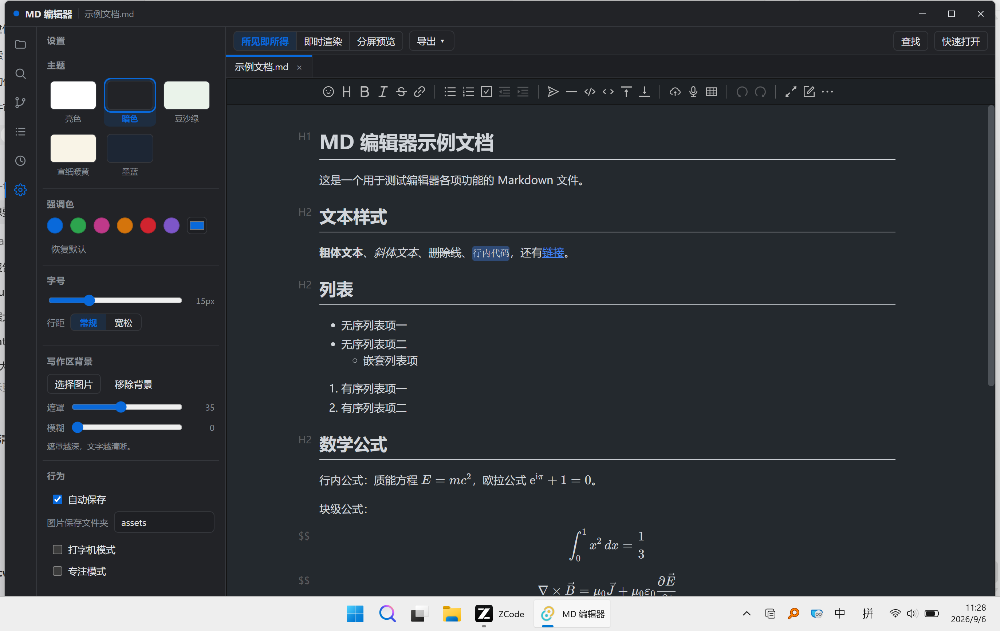

# MD 编辑器

本地轻量、离线优先的 Markdown 桌面编辑器。基于 Tauri 2 构建，安装包不到 7 MB，不联网也能完整使用。

[](https://tauri.app)
[](https://vuejs.org)
[](LICENSE)


## 📷 截图

| 亮色主题 | 暗色主题 |
| :---: | :---: |
|  |  |

## ✨ 功能特性

**编辑**

- **三种编辑模式**：所见即所得、即时渲染、分屏预览，工具栏一键切换
- **KaTeX 数学公式**：行内 `$...$`、块级 `$$...$$`
- **大纲面板**：标题层级导航，点击跳转、滚动联动高亮
- **图片粘贴**：粘贴 / 拖拽 / 截图直接存入工作区图片文件夹，自动插入相对路径
- **查找替换**：Ctrl+F 匹配计数、上下导航、大小写开关、单个 / 全部替换
- **打字机 / 专注模式**：光标所在块居中、非当前块淡化
- **导出**：单文件 HTML（样式与公式内联，离线可看）、PDF（系统打印）、复制为 HTML

**文件**

- **文件树 + 多标签页**：打开本地文件夹，支持新建 / 重命名 / 删除，目录懒加载；.txt 等纯文本也能直接编辑
- **快速打开**：Ctrl+P 按文件名模糊搜索直达
- **全文搜索**：整个工作区按内容搜索，关键词高亮
- **最近打开**：文件夹与文件各保留 10 条记录
- **外部修改检测**：文件被其他程序改动时提示「重新加载 / 保留我的版本」
- **本地历史快照**：每次保存自动留存旧版，误删可回滚

**其他**

- **多窗口**：一窗一文件（Typora 模式），文件树 / 标签页右键「在新窗口打开」，主题与设置跨窗口实时同步
- **Git 集成**：分支显示、改动列表与文件树角标、提交全部改动、提交历史、拉取 / 推送（需系统安装 Git）
- **自定义主题与背景**：5 套主题预设、强调色、字号行距、写作区背景图（遮罩 / 模糊可调）
- **命令面板**：Ctrl+Shift+P 汇聚全部命令
- **自动保存 + Ctrl+S**：输入防抖自动保存
- **完全离线**：编辑器资源（Vditor、KaTeX、代码高亮）本地化部署，运行全程不需要联网
- **轻量**：安装包不到 7 MB，界面由系统 WebView2 渲染，不打包浏览器内核

## 📦 下载安装

前往 [Releases](https://github.com/th9017/md-editor/releases)，两种形态任选：

- **安装版** `MD-Editor_x.y.z_x64-setup.exe`：双击安装，数据存于系统用户目录，后续升级平滑覆盖
- **便携版** `MD-Editor-portable.zip`：解压即用、免安装；`MD-Editor.exe` 与 `portable.flag` 放同一目录，背景图与本地历史快照随程序目录整体移动（删除 `portable.flag` 即恢复系统目录存储）

系统要求：Windows 10 / 11（依赖 WebView2 运行时，一般系统已内置）；Git 集成功能需系统安装 [Git](https://git-scm.com/)。

装好后可以「打开文件夹」选择仓库里的 `examples/` 目录，其中 `示例文档.md` 覆盖了常用语法和公式，用来快速上手。

## 🛠 从源码构建

前置要求：

- Node.js LTS
- Rust stable（MSVC 工具链，需安装 Visual Studio C++ 生成工具）
- WebView2 运行时（Windows 10/11 通常已内置）

```bash
# 安装依赖
npm install

# 开发模式运行
npm run tauri dev

# 打包 Windows 安装程序（NSIS）
npm run tauri build -- --bundles nsis

# 追加打包便携版 zip
npm run build:portable
```

技术栈：Tauri 2 (Rust) 桌面外壳，Vue 3 + Vite + TypeScript 前端，编辑器基于 [Vditor](https://github.com/Vanessa219/vditor)，纯文本编辑基于 CodeMirror 6，搜索 / 快速打开 / Git / 历史快照等由 Rust 标准库实现，无额外依赖。

## 🗺 路线图

- 多光标编辑与更完整的 Vim 模式
- 导出 Word / 长图
- 主题 CSS 自定义文件

想法和需求欢迎提 [Issue](https://github.com/th9017/md-editor/issues)。

## 🤝 贡献

欢迎提 Issue 和 PR：

- 报告问题时请带上系统版本、复现步骤和预期 / 实际表现
- 提交代码建议先开 Issue 讨论方案，Fork 后建分支修改，PR 里说明改动了什么
- **AI 辅助开发请先阅读 [AGENTS.md](AGENTS.md)**（仓库架构约定与修改规范）

## 📄 许可证

[MIT](LICENSE) © 2026 th9017
